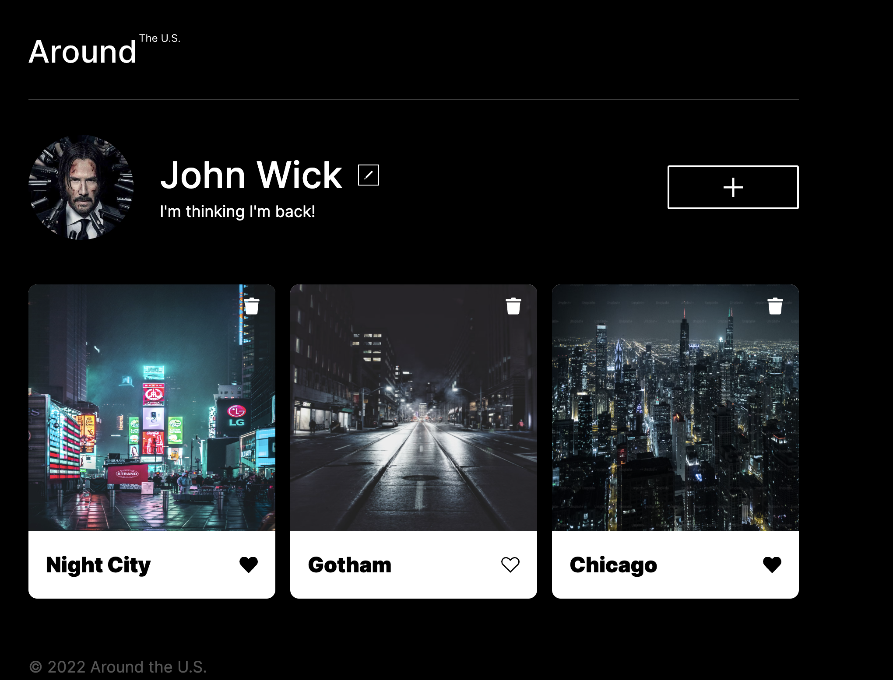

# Around The U.S. : Social Media Light Application

Around The U.S. is a lightweight social media application, where you can insert an image url, and it will appear as a Card. With an adaptive display that caters to various screen sizes, it allows users to interact seamlessly regardless of their device. Integration with APIs ensures user content is saved and persistent.

[**Live Site**](https://fostert14.github.io/se_project_aroundtheus/)

## Features

- **Adaptive Display**: The application is responsive and fits well on devices of all sizes.
- **Loose Coupling**: Easily create and instantiate new elements on the website.
- **Form Validation**: All form popups have required text, and reset when submitted
- **API Interaction**: Use an API with an authentication token for data persistence.

_Note: Replace 'path-to-your-screenshot.png' with a real path to a screenshot or gif of your app._

## Technologies Used

- HTML
- CSS
  - Grid Display
  - Flex Display
- JavaScript
- API Interaction
